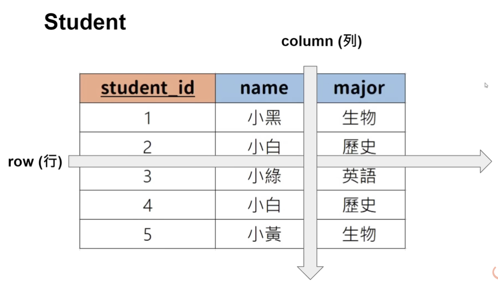

# 1.基本語法

本章節的內容參考自: GrandmaCan -我阿嬤都會 【資料庫】SQL 3小時初學者教學



* **SQL (Structured Query Language**，**結構化查詢語言)**

## tables and keys

* tables ⇒ 表格
* table 設定 keys 之後就可以在table之間設定關聯
* row, column
  * 每個row 都是一筆資料
  * 每個column都是一個屬性\
    
* **primary key (主鍵)**
  * 能夠區分每一筆資料的屬性 ⇒ 就可以設為主鍵\
    .png>)
* **foreign key (外鍵)**
  * 如果需要表格跟表格之前產生關聯, 就可以設定 foreign key 去對應到另外一個表格
  * foreign key 對應到的一定是定外一個table 的 primary key
  * foreign key 也可以對應到自己 table 的 主鍵\
    .png>)

## 1. Create Datebase

在mysql裡面，關鍵字會顯示成藍色，通常用大寫表示

<figure><figcaption></figcaption></figure>

閃電 : 執行框起來那段的語法

閃電+I : 執行滑鼠位置那行的語法


* `CREATE DATABASE sql_tutorial`; 建立資料庫
* `DROP DATABASE sql_tutorial;` 刪除資料庫
* `SHOW databases`; 顯示資料庫
  *   其他四個是mysql內建的

      <figure><figcaption></figcaption></figure>


* 建立資料庫的時候避免跟關鍵字混淆, 因此用\`\`包起來

```sql
CREATE DATABASE `sql_tutorial`;
SHOW databases;
DROP DATABASE `sql_tutorial`;
```


## 2. Create Table

* `USE sql_tutorial;` 選擇database
* 資料型態
  1. INT：整數
  2. DECIMAL(m, n)：有小數點的數(m: 有幾位數, n: 小數點佔了幾位)
     1. DECIMAL(3, 2) 代表有三位數，小數點佔了兩位，例如 2.33
  3. VARCHAR(n)：字串 (n: 最多可以存在幾個字元)
  4. BLOB：(Binary Large Object 二進制資料) 圖片 影片 檔案…
  5. DATE：'YYYY-MM-DD' 日期
  6. TIMESTAMP： 'YYYY-MM-DDHH:MM:SS' 紀錄時間


*   建立table

    * `CREATE TABLE` student `( )`: 建立table, 小括號裡面放屬性
    * `student_id int PRIMARY KEY` : 數字跟主鍵\
      .png>)

    ```sql
    CREATE TABLE `student`( 
    	`student_id` int PRIMARY KEY,
      `name` VARCHAR(20),
      `major` VARCHAR(20)
    );
    ```


* `DESCRIBE student;`  查看表格長的樣子\
  .png>)
* `DROP TABLE student;`  刪除表格


### 新增與刪除欄位

* `ALTER TABLE` student `ADD gpa DECIMAL (3,2);`
* `ALTER TABLE` student `DROP COLUMN gpa;`


### paimary key 寫法

1.  跟著欄位一起寫

    ```sql
    CREATE TABLE `student`( 
    	`student_id` int PRIMARY KEY,
      `name` VARCHAR(20),
      `major` VARCHAR(20)
    );
    ```
2.  獨立出來

    ```sql
    CREATE TABLE `student`(
    	`student_id` int ,
        `name` VARCHAR(20),
        `major` VARCHAR(20),
        PRIMARY KEY(`student_id`)
    );
    ```


## 3. 儲存資料

<figure><figcaption></figcaption></figure>

* `INSERT INTO` student `VALUES(1, "小白", "歷史");` 儲存資料(按照設計欄位的順序)
  * `INSERT INTO` student `VALUES(3, "小綠", NULL);`
* INSERT INTO `student`(`name`, `major`, `student_id`) VALUES("小白", "英語", 4); **自訂輸入欄位的順序**
  *   IINSERT INTO `student`(`major`, `student_id`) VALUES("英語", 5);\
      用自訂的方法可以只填某幾個欄位(一定要填paimary key)\


      <figure><figcaption></figcaption></figure>
*   `SELECT * FROM` student`;` 搜尋資料\


    <figure><figcaption></figcaption></figure>


```sql
CREATE DATABASE `sql_tutorial`; -- 建立表格
SHOW databases; -- 顯示database
USE `sql_tutorial`; -- 使用哪個database

CREATE TABLE `student`(  -- 建立table
	`student_id` int ,
    `name` VARCHAR(20),
    `major` VARCHAR(20),
    PRIMARY KEY(`student_id`)
);

DESCRIBE `student`; -- 顯示table
DROP TABLE `student`; -- 刪除table

ALTER TABLE `student` ADD gpa DECIMAL (3,2); -- 在table增加欄位
ALTER TABLE `student` DROP COLUMN gpa;       -- 在table刪除欄位

CREATE TABLE `student`(
	`student_id` int ,
    `name` VARCHAR(20),
    `major` VARCHAR(20),
    PRIMARY KEY(`student_id`)
);

INSERT INTO `student` VALUES(1, "小白", "歷史"); -- 儲存資料
INSERT INTO `student` VALUES(2, "小黑", "生物");
INSERT INTO `student` VALUES(5, "小黃");

INSERT INTO `student`(`name`, `major`, `student_id`) VALUES("小白", "英語", 4); -- 自訂順序
INSERT INTO student(major, student_id) VALUES("英語", 5);  -- 自訂順序可以只填某些欄位

SELECT * FROM `student`; -- 搜尋資料
```


## 4. 限制、約束

1. `NOT NULL` : 值不可以為空
2.  `UNIQUE` : 值不可以重複

    ```sql
    CREATE TABLE `student`(  -- 建立table
    	`student_id` int ,
        `name` VARCHAR(20) NOT NULL,
        `major` VARCHAR(20) UNIQUE,
        PRIMARY KEY(`student_id`)
    );
    ```
3.  `DEFAULT` : 預設值設定

    ```sql
    CREATE TABLE `student`( 
    	`student_id` int ,
        `name` VARCHAR(20) NOT NULL,
        `major` VARCHAR(20) **DEFAULT** "歷史",
        PRIMARY KEY(`student_id`)
    );

    INSERT INTO `student`(`name`, student_id) VALUES("小綠", 5);
    ```
4.  `AUTO_INCREMENT` **:** 自動增加

    ```sql
    CREATE TABLE `student`( 
    	`student_id` int **AUTO_INCREMENT**,
        `name` VARCHAR(20) NOT NULL,
        `major` VARCHAR(20) DEFAULT "歷史",
        PRIMARY KEY(`student_id`)
    );

    INSERT INTO `student`(`name`, `major`) VALUES("小白", "英語");
    INSERT INTO `student`(`name`, `major`) VALUES("小黑", "國語");
    INSERT INTO `student`(`name`, `major`) VALUES("小綠", "歷史");
    SELECT * FROM `student`; -- 搜尋資料
    ```


## 5. 修改 & 刪除資料

*   `SET SQL_SAFE_UPDATES = 0;` 安全模式關掉

    大多數 MySQL 數據庫管理系統中，啟用安全更新模式時，UPDATE 和 DELETE 操作需要包含 WHERE 子句，以確保不會無意中更新或刪除整個表的數據。

1.  更改值

    ```sql
    UPDATE `student`
    SET `major` = '英語文學'
    WHERE `major` = "英語";
    ```
2.  OR : 多個條件搜尋

    ```sql
    UPDATE `student`
    SET `major` = "生化"
    WHERE `major` = "生物" OR `major` = "化學";
    ```
3.  更改多個欄位

    ```sql
    UPDATE `student`
    SET `major` = '物理', `name` = "小安"
    WHERE `student_id` = 3;
    ```
4.  更改全部 (沒有加上where就會全更改)

    ```sql
    UPDATE `student`
    SET `major` = "生化";
    ```
5.  刪除資料

    ```sql
    DELETE FROM `student`
    WHERE `student_id` = 3;

    -- 多個條件
    DELETE FROM `student` 
    WHERE `major` = "生化" AND `name` = "小黃";

    DELETE FROM `student` 
    WHERE `score` < 60;
    ```
6.  刪除整個資料

    ```sql
    DELETE FROM `student`;
    ```


## 5. 取得資料

1.  取得所有資料

    ```sql
    SELECT * FROM `student`;
    ```
2.  只取得某項資料

    ```sql
    SELECT `name` FROM `student`;

    SELECT `name`,`major` FROM `student`;
    ```
3.  `ORDER` : 排序

    * 正向排序(默認) : `ASC` (由低到高)
    * 反向排序 : 最後加上`DESC` (由高到低)

    ```sql
    SELECT * 
    FROM `student`
    ORDER BY `score`;

    --反向排序
    SELECT * 
    FROM `student`
    ORDER BY `score` DESC; 

    ```
4.  多項條件排序

    ```sql
    SELECT * 
    FROM `student`
    ORDER BY `score`, `student_id`;  --先根據score排序, 如果相同才按照student_id排序
    ```
5.  限制回傳數量

    ```sql
    SELECT * 
    FROM `student`
    LIMIT 2;

    -- 取得前三高的分數
    SELECT *  
    FROM `student`
    ORDER BY `score` DESC 
    LIMIT 3;
    ```
6.  `<>` : 不等於

    ```sql
    SELECT * 
    FROM `student`
    WHERE `major` = "英語" and `score` <> 60
    LIMIT 3;
    ```
7.  `IN` :

    ```sql
    SELECT * 
    FROM `student`
    WHERE `major` IN ("歷史", "英語", "生物");

    --等於以下
    SELECT * 
    FROM `student`
    WHERE `major` = "歷史" OR `major` = "英語" OR `major` = "生物";
    ```
8.  `NOT IN`

    ```sql
    SELECT *
    FROM `student`
    WHERE `major` NOT IN ("歷史", "英語") 
    ```


